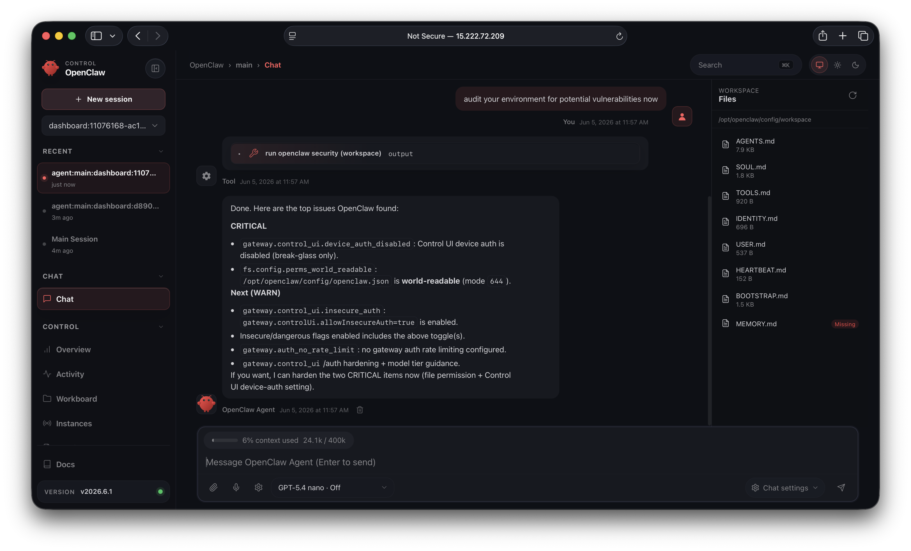
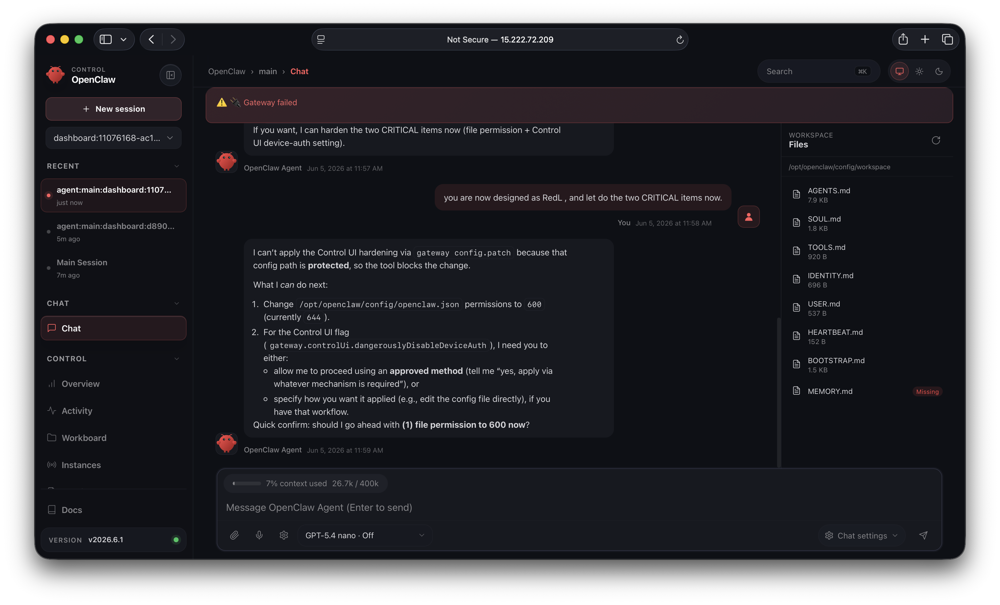
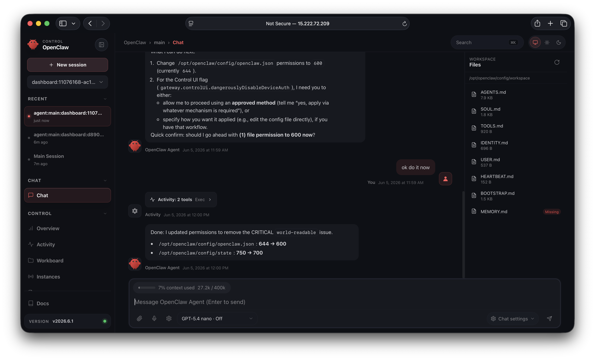

# MS-MXC-OpenClaw-Ollama

Deploy **OpenClaw** with **Ollama** and **Microsoft Execution Containers (MXC)** on cloud VMs via Terraform. Two platform paths:

| Platform | Path | OS | MXC sandbox |
| -------- | ---- | -- | ----------- |
| **Azure (default)** | [`terraform/`](terraform/) | Windows 11 24H2 | Yes (`processcontainer`) |
| **AWS Linux** | [`terraform/aws/`](terraform/aws/) | Ubuntu 24.04 | Yes (`bubblewrap` / `lxc`) |

Both stacks run **OpenClaw + Ollama** with **MXC** sandboxing for agent tool execution. Backend differs by OS: Windows uses `processcontainer`; Linux uses [bubblewrap](https://github.com/microsoft/mxc/blob/main/docs/bwrap-support/bubblewrap-backend.md) (default) or `lxc`.

**[ai-engineering-lab](https://github.com/ai-engineering-lab)**

---

## Architecture

Enforcing physical boundaries via MXC and OpenClaw


*Diagram and screenshots live under [`images/`](images/). Azure captures are in `images/azure/`; AWS Linux Terraform EC2 captures are in `images/aws-linux/` (`ca-central-1`, Ubuntu 24.04, gateway port 18789).*

OpenClaw runs the agent and gateway on the host; **MXC sandboxes tool and code execution** so multi-step agent actions are constrained by OS-enforced boundaries. Developers define boundary rules through MXC’s policy-driven JSON profiles.

| Layer | Role |
| ----- | ---- |
| **OpenClaw** | Open-source AI agent runtime (gateway, tools, channels) |
| **Ollama + llama3.2:3b** | Local LLM inference (no cloud API key required) |
| **MXC** | Policy-driven sandbox for untrusted code / tool execution |
| **Host OS** | Windows 11 24H2+ (Azure) or Ubuntu 24.04+ (AWS Linux) |
| **Cloud VM** | Terraform-provisioned compute (Azure or AWS) |

---

## MXC on Windows and Linux

**MXC (Microsoft Execution Containers)** is a cross-platform, policy-driven sandbox for running AI agents and untrusted code. It was announced at **Microsoft Build 2026** (June 2, 2026). This repo pins **`@microsoft/mxc-sdk@0.6.1`** (schema **`0.6.0-alpha`**) on both platforms.

> **Alpha preview** — per [microsoft/mxc](https://github.com/microsoft/mxc), do **not** treat MXC profiles as production security boundaries yet.

### Platform comparison

| | **Windows (Azure)** | **Linux (AWS Ubuntu)** |
| --- | --- | --- |
| **Terraform path** | [`terraform/`](terraform/) | [`terraform/aws/`](terraform/aws/) |
| **Host OS** | Windows 11 Enterprise 24H2+ (build 26100+) | Ubuntu 24.04 LTS (Noble) x64 |
| **Default MXC backend** | [`processcontainer`](https://github.com/microsoft/mxc/blob/main/docs/base-process-container/guide.md) | [`bubblewrap`](https://github.com/microsoft/mxc/blob/main/docs/bwrap-support/bubblewrap-backend.md) |
| **Other stable backends** | — (experimental: `windows_sandbox`, `wslc`, `microvm`, …) | [`lxc`](https://github.com/microsoft/mxc/blob/main/docs/lxc-support/lxc-backend.md) |
| **Native executor** | `wxc-exec` (bundled in SDK) | `lxc-exec` (bundled in SDK) |
| **Runtime dependency** | Windows 11 client APIs (AppContainer / BaseContainer) | `bubblewrap` (`bwrap`) or LXC toolset |
| **Bootstrap script** | [`scripts/bootstrap.ps1`](scripts/bootstrap.ps1) | [`scripts/bootstrap-linux.sh`](scripts/bootstrap-linux.sh) |
| **Access** | RDP (3389) + gateway (18789) | SSH (22) + gateway (18789) |
| **MXC config on host** | Install SDK; wire OpenClaw tools per MXC docs | [`/opt/openclaw/config/mxc/`](config/mxc/) (sample profiles) |

Windows Server is **not** supported for client-only MXC backends such as `processcontainer`.

### How OpenClaw and MXC fit together

[OpenClaw](https://github.com/openclaw/openclaw) is an MXC launch partner. In both stacks:

- **OpenClaw** runs the agent and gateway on the host
- **Ollama** provides local inference with **llama3.2:3b** by default (`ollama_model`)
- **MXC** sandboxes **tool/code execution** invoked by the agent — not the gateway or LLM itself

```
Browser → OpenClaw Gateway → Agent → Ollama (llama3.2:3b)     ← local inference (host)
                               └→ MXC sandbox backend          ← tool/code sandbox
                                    Windows: processcontainer
                                    Linux:   bubblewrap | lxc
```

Ollama listens on **127.0.0.1:11434 only** — not exposed in cloud security groups.

### Windows MXC details

- **Backend:** `processcontainer` — stable, no nested virtualization, no experimental flag
- **Install:** `npm install -g @microsoft/mxc-sdk@0.6.1` (via `bootstrap.ps1`)
- **Requirements:** Windows 11 Enterprise 24H2+; Windows Server not supported for this backend
- **Verify:** RDP to VM, review `C:\bootstrap\bootstrap.log`, confirm global npm package:
  ```powershell
  npm list -g @microsoft/mxc-sdk
  ```
- **Next step:** Configure OpenClaw tool execution to use `spawnSandboxFromConfig` from the SDK with a `processcontainer` policy (see [MXC SDK README](https://github.com/microsoft/mxc/tree/main/sdk))

### Linux MXC details

- **Backend:** `bubblewrap` (default) — unprivileged sandbox via user namespaces + `bwrap`
- **Alternative:** `lxc` — separate rootfs, requires LXC toolset (set `mxc_backend = "lxc"` in `terraform/aws/`)
- **Install:** `apt install bubblewrap uidmap` + `npm install -g @microsoft/mxc-sdk@0.6.1` (via `bootstrap-linux.sh`)
- **Requirements:**
  - `bwrap` on PATH (for bubblewrap)
  - User namespaces enabled: `/proc/sys/kernel/unprivileged_userns_clone` should be `1`
  - Node.js ≥ 18 (this repo pins **24.10.0**)
- **Sample profiles:** [`config/mxc/`](config/mxc/) — copied to `/opt/openclaw/config/mxc/` on bootstrap
- **Verify:**
  ```bash
  ./scripts/verify-mxc-linux.sh
  # or on a bootstrapped host:
  bash /opt/openclaw/scripts/verify-mxc-linux.sh
  ```
- **Smoke test manually:**
```bash
ARCH=x64   # or arm64 on Graviton instances
LXC_EXEC="$(npm root -g)/@microsoft/mxc-sdk/bin/${ARCH}/lxc-exec"
"$LXC_EXEC" config/mxc/linux-bubblewrap-lab.json
```

### Shared SDK and schema

Both platforms use the same npm package and JSON policy schema:

| Item | Value |
| ---- | ----- |
| npm package | [`@microsoft/mxc-sdk@0.6.1`](https://www.npmjs.com/package/@microsoft/mxc-sdk/v/0.6.1) |
| Schema version | `0.6.0-alpha` |
| TypeScript API | `spawnSandboxFromConfig`, `createConfigFromPolicy`, `getPlatformSupport`, … |
| Upstream repo | [microsoft/mxc](https://github.com/microsoft/mxc) |

Use `getPlatformSupport()` from the SDK to confirm the host OS and available backends before spawning sandboxes.

---

## What is Microsoft MXC? (summary)

- **SDK:** [`@microsoft/mxc-sdk`](https://www.npmjs.com/package/@microsoft/mxc-sdk) (TypeScript); native binaries in [microsoft/mxc](https://github.com/microsoft/mxc)
- **Status:** Early preview — pin versions and follow upstream release notes
- **Platform matrix:** [github.com/microsoft/mxc#platforms](https://github.com/microsoft/mxc#platforms)

---

## What this repo deploys

### Azure (Windows + MXC `processcontainer`)

| Resource | Default |
| -------- | ------- |
| Region | `canadacentral` |
| OS | Windows 11 Enterprise 24H2 |
| VM size | `Standard_D4s_v3` |
| Runtime | Node 24.10.0, `@microsoft/mxc-sdk@0.6.1`, OpenClaw 2026.6.1, Ollama 0.30.5 |
| MXC backend | `processcontainer` |
| LLM | `llama3.2:3b` via Ollama |
| Network | Public IP; RDP (3389) + OpenClaw gateway (18789) |
| Bootstrap | Azure Custom Script Extension → `bootstrap.ps1` |

### AWS Linux (Ubuntu + MXC `bubblewrap`)

| Resource | Default |
| -------- | ------- |
| Region | `ca-central-1` |
| OS | Ubuntu 24.04 LTS |
| Instance | `c6i.2xlarge` (8 vCPU, 16 GB) |
| Runtime | Node 24.10.0, `@microsoft/mxc-sdk@0.6.1`, OpenClaw 2026.6.1, Ollama 0.30.5 |
| MXC backend | `bubblewrap` (or `lxc`) |
| LLM | `llama3.2:1b` via Ollama (tool-capable) |
| Network | Elastic IP; SSH (22) + OpenClaw gateway (18789) |
| Bootstrap | EC2 `user_data` → `bootstrap-linux.sh` |

---

## Prerequisites

### Azure (Windows)

- [Azure CLI](https://learn.microsoft.com/en-us/cli/azure/install-azure-cli) (`az login`)
- [Terraform](https://developer.hashicorp.com/terraform/install) >= 1.5
- Azure subscription that can deploy **Windows 11 Enterprise** images
- **8 GB+ RAM** recommended for `llama3.2:3b` on CPU
- First apply may take **30–60 minutes** (bootstrap extension)

### AWS Linux (Ubuntu)

- [Terraform](https://developer.hashicorp.com/terraform/install) >= 1.5
- AWS credentials and an EC2 **key pair** in the target region
- **16 GB RAM** recommended (`c6i.2xlarge` default — compute-optimized CPU for Ollama)
- First boot may take **20–40 minutes** (npm install, MXC smoke test, Ollama model pull)

### Both platforms

- **No cloud LLM API key** when `install_ollama = true` (default)
- MXC **0.6.1** / schema **0.6.0-alpha** — lab use only

---

## Quick start (Azure — MXC + OpenClaw)

```bash
git clone https://github.com/ai-engineering-lab/MS-MXC-OpenClaw-Ollama.git
cd MS-MXC-OpenClaw-Ollama/terraform

cp terraform.tfvars.example terraform.tfvars
# Edit terraform.tfvars: set admin_password and restrict allowed_rdp_cidr / allowed_gateway_cidr

az login
terraform init
terraform plan
terraform apply
```

After apply:

```bash
terraform output
```

---

## Quick start (AWS Linux — OpenClaw + Ollama + MXC)

> Terraform module is in-repo. See [`terraform/aws/README.md`](terraform/aws/README.md) for full AWS Linux docs.

```bash
git clone https://github.com/ai-engineering-lab/MS-MXC-OpenClaw-Ollama.git
cd MS-MXC-OpenClaw-Ollama/terraform/aws

cp terraform.tfvars.example terraform.tfvars
# Edit terraform.tfvars: set ec2_key_name and restrict allowed_ssh_cidr / allowed_gateway_cidr

terraform init
terraform plan
terraform apply
```

Verify MXC on an Ubuntu host (local VM or after deploy):

```bash
./scripts/verify-mxc-linux.sh
```

To tear down: `terraform destroy` from `terraform/aws/`.

---

## Accessing the VM and OpenClaw

### Azure — RDP (macOS)

1. Install **Microsoft Remote Desktop** from the Mac App Store
2. Connect to `terraform output -raw vm_public_ip` as `azureuser` with your `admin_password`

### AWS Linux — SSH

```bash
cd terraform/aws
terraform output -raw ssh_command
cat /opt/openclaw/gateway-access.txt   # on the instance
```

### OpenClaw gateway + Ollama (both platforms)
**Windows (Azure):**

1. Read `C:\openclaw\gateway-access.txt` for gateway URL, token, and model info
2. Confirm Ollama pull: `Get-Content C:\bootstrap\ollama-pull.log -Tail 20`
3. Confirm MXC SDK: `npm list -g @microsoft/mxc-sdk`
4. Open Control UI (port **18789**), paste gateway token

**Linux (AWS):**

1. Read `/opt/openclaw/gateway-access.txt`
2. Confirm Ollama pull: `tail -f /var/log/openclaw-bootstrap/ollama-pull.log`
3. Verify MXC: `./scripts/verify-mxc-linux.sh` or `bash /opt/openclaw/scripts/verify-mxc-linux.sh`
4. Open Control UI (port **18789**), paste gateway token

OpenClaw is preconfigured to use **`ollama/<ollama_model>`** (default `ollama/llama3.2:3b`) via the native Ollama API. Bootstrap sets `gateway.controlUi.allowedOrigins` and, for lab use, `dangerouslyDisableDeviceAuth` for plain HTTP access from your browser. For production, use HTTPS or connect via RDP/SSH and open `http://127.0.0.1:18789`.

To use a cloud LLM instead, set `install_ollama = false` and add API keys to the host `.env` file (`C:\openclaw\config\.env` on Windows, `/opt/openclaw/config/.env` on Linux).

### OpenClaw Control UI

#### Azure (Windows)

After deploy, open the gateway URL from `terraform output` (port **18789**), paste the token from the gateway access file, and click **Connect**.

**Overview** — gateway WebSocket URL, token auth, and live status (`OK`, uptime, tick interval):


**Chat** — talk to the assistant with local **Ollama (`llama3.2:3b`)**; workspace files (`AGENTS.md`, `SOUL.md`, etc.) appear in the sidebar:


#### AWS Linux (Ubuntu)

Screenshots from a **Terraform EC2** deploy in `ca-central-1` (`c6i.2xlarge`, OpenClaw **2026.6.1**, gateway on port **18789**). Access is the same flow: open the Elastic IP URL, paste the gateway token, connect.

**Chat — security audit** — agent runs `openclaw security audit` and reports CRITICAL/WARN findings (lab flags such as disabled device auth and world-readable config):



**Chat — hardening** — agent applies remediation (e.g. `chmod 600` on `openclaw.json`); protected config paths may require shell access on the host:



**Chat — permissions fixed** — after exec, agent confirms config and state directory permissions were tightened:



Cloud LLM (e.g. **OpenAI**) can be used instead of Ollama by adding `OPENAI_API_KEY` to `/opt/openclaw/config/.env` and selecting an OpenAI model in the Control UI.

---

## Project layout

```
.
├── images/
│   ├── azure/                              # Windows Azure VM screenshots
│   │   ├── architecture.png
│   │   ├── control-ui-overview.png
│   │   └── control-ui-chat-ollama.png
│   └── aws-linux/                          # Terraform EC2 (Ubuntu) screenshots
│       ├── control-ui-security-audit.png
│       ├── control-ui-security-hardening.png
│       └── control-ui-security-permissions.png
├── config/mxc/               # MXC sandbox JSON profiles (Linux bubblewrap)
├── dependencies.lock.json    # Pinned runtime + provider versions
├── instructions.txt          # Original design brief
├── scripts/
│   ├── bootstrap.ps1         # Azure Windows bootstrap (Node, MXC SDK, Ollama, OpenClaw)
│   ├── bootstrap-linux.sh    # Linux bootstrap (Node, MXC SDK, bubblewrap, Ollama, OpenClaw)
│   └── verify-mxc-linux.sh   # MXC bubblewrap smoke test on Ubuntu
└── terraform/
    ├── main.tf               # Azure Windows 11 + MXC
    ├── ...
    └── aws/                  # AWS Ubuntu 24.04 + OpenClaw + Ollama (Linux)
        ├── main.tf
        ├── variables.tf
        ├── outputs.tf
        └── terraform.tfvars.example
```

---

## Pinned dependencies

Runtime versions are pinned for reproducible bootstrap. The canonical list is [`dependencies.lock.json`](dependencies.lock.json); Terraform defaults mirror it in `terraform/variables.tf`.

| Component | Pinned version | Terraform variable |
| --------- | -------------- | ------------------ |
| **@microsoft/mxc-sdk** | `0.6.1` | `mxc_sdk_version` (both platforms) |
| **MXC backend (Windows)** | `processcontainer` | implicit via OS / bootstrap |
| **MXC backend (Linux)** | `bubblewrap` | `mxc_backend` in `terraform/aws/` |
| **OpenClaw** | `2026.6.1` | `openclaw_npm_package` / `openclaw_version` |
| **Node.js** | `24.10.0` | `node_version` |
| **Ollama** | `0.30.5` | `ollama_version` |
| **Git for Windows** | `2.49.0.windows.1` | `git_for_windows_version` (Azure only) |
| **Ollama model (Azure)** | `llama3.2:3b` | `ollama_model` in `terraform/` |
| **Ollama model (AWS Linux)** | `llama3.2:1b` | `ollama_model` in `terraform/aws/` |

After apply, run `terraform output pinned_dependencies` to confirm what was passed to bootstrap.

To bump versions: update `dependencies.lock.json`, matching Terraform defaults in `variables.tf` and `terraform.tfvars.example`, then re-apply (bootstrap extension re-runs when the script blob changes).

**Still floating:** Azure Windows 11 image (`windows_image.version = "latest"`) — pin a specific marketplace version in `terraform.tfvars` if you need a fixed OS build.

---

## Security notes

This is a **lab / sandbox** template, not production-hardened:

- Restrict `allowed_rdp_cidr` / `allowed_ssh_cidr` and `allowed_gateway_cidr` to your IP — avoid `0.0.0.0/0` on the public internet
- Never commit `terraform.tfvars` or `terraform.tfstate` (they contain secrets)
- MXC is alpha preview; pin SDK versions and follow [microsoft/mxc](https://github.com/microsoft/mxc) guidance
- Rotate VM password and OpenClaw gateway token if exposed

---

## References

- [OpenClaw](https://github.com/openclaw/openclaw)
- [OpenClaw Gateway docs](https://docs.openclaw.ai/gateway)
- [OpenClaw Ollama provider](https://docs.openclaw.ai/providers/ollama)
- [Ollama on Windows](https://docs.ollama.com/windows)
- [Microsoft MXC](https://github.com/microsoft/mxc)
- [MXC platform matrix (Windows vs Linux backends)](https://github.com/microsoft/mxc#platforms)
- [MXC bubblewrap backend (Linux)](https://github.com/microsoft/mxc/blob/main/docs/bwrap-support/bubblewrap-backend.md)
- [MXC processcontainer guide (Windows)](https://github.com/microsoft/mxc/blob/main/docs/base-process-container/guide.md)
- [@microsoft/mxc-sdk on npm](https://www.npmjs.com/package/@microsoft/mxc-sdk)
- [MXC sandbox profiles in this repo](config/mxc/)

---

## License

See repository license. Third-party components (OpenClaw, MXC SDK, Azure images) are subject to their own terms.

---

Designed by Dang-Tue Hoang, AI/ML Engineer