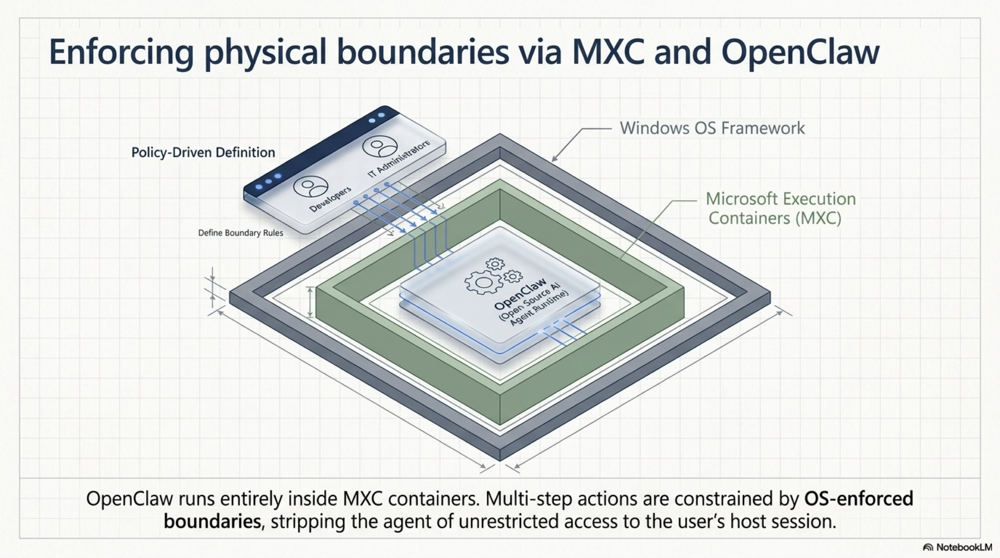
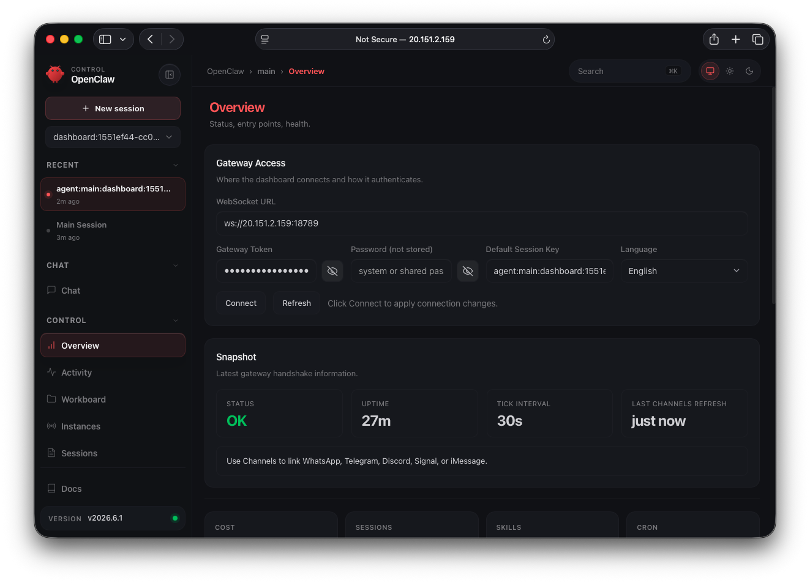
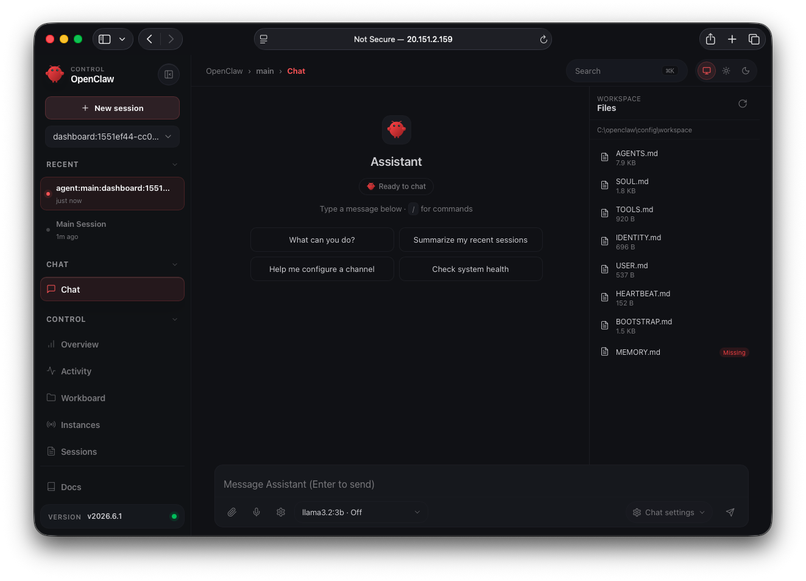

# Neuro MXC OpenClaw Azure Sandbox

Deploy **OpenClaw** on **Azure** in one Terraform apply: a Windows 11 VM with **Microsoft Execution Containers (MXC)** sandboxing for safer AI agent tool execution.

**[ai-engineering-lab](https://github.com/ai-engineering-lab)**

---

## Architecture

Enforcing physical boundaries via MXC and OpenClaw



OpenClaw runs inside MXC containers on Windows. Multi-step agent actions are constrained by **OS-enforced boundaries**, reducing unrestricted access to the host session. Developers and IT administrators define boundary rules through MXC’s policy-driven profiles.


| Layer                | Role                                                                |
| -------------------- | ------------------------------------------------------------------- |
| **OpenClaw**         | Open-source AI agent runtime (gateway, tools, channels)             |
| **Ollama + llama3.2:3b** | Local LLM inference (no cloud API key required)                 |
| **MXC**              | Policy-driven, OS-level sandbox for untrusted code / tool execution |
| **Windows 11 24H2+** | Required host OS for MXC client backends                            |
| **Azure VM**         | Terraform-provisioned compute in `canadacentral` (configurable)     |


---

## What is Microsoft MXC?

**MXC (Microsoft Execution Containers)** is a policy-driven, OS-level sandbox for running AI agents and untrusted code. It was announced at **Microsoft Build 2026** (June 2, 2026).

- **SDK:** `[@microsoft/mxc-sdk](https://www.npmjs.com/package/@microsoft/mxc-sdk)` (TypeScript); native runtime in [microsoft/mxc](https://github.com/microsoft/mxc)
- **Status:** Early preview (schema ~`0.6.0-alpha`) — **do not treat MXC profiles as production security boundaries yet**
- **Requirements:** Windows 11 Enterprise 24H2+ (build 26100+); Windows Server is **not** supported for client-only MXC backends

### Integration with OpenClaw

[OpenClaw](https://github.com/openclaw/openclaw) is an MXC launch partner. In this project:

- **OpenClaw** runs the agent and gateway
- **Ollama** provides local inference with **llama3.2:3b** by default (configurable via `ollama_model`)
- **MXC** sandboxes the agent’s tool and code execution via the `processcontainer` backend (stable, no nested virtualization required)

```
Browser → OpenClaw Gateway → Agent → Ollama (llama3.2:3b)  ← local inference
                               └→ MXC processcontainer    ← tool/code sandbox
```

Ollama listens on **localhost:11434 only** — it is not exposed in the Azure NSG.

---

## What this repo deploys


| Resource  | Default                                                          |
| --------- | ---------------------------------------------------------------- |
| Region    | `canadacentral`                                                  |
| OS        | Windows 11 Enterprise 24H2                                       |
| VM size   | `Standard_D4s_v3` (adjust for your quota)                        |
| Runtime   | Node 24.10.0, `@microsoft/mxc-sdk@0.6.1`, OpenClaw 2026.6.1, Ollama 0.30.5 |
| LLM       | `llama3.2:3b` via Ollama (`install_ollama = true`)               |
| Network   | Public IP, NSG rules for RDP (3389) and OpenClaw gateway (18789) |
| Bootstrap | Custom Script Extension installs gateway; Ollama model pull runs in background |


---

## Prerequisites

- [Azure CLI](https://learn.microsoft.com/en-us/cli/azure/install-azure-cli) (`az login`)
- [Terraform](https://developer.hashicorp.com/terraform/install) >= 1.5
- Azure subscription that can deploy **Windows 11 Enterprise** images (Dev/Test, AVD licensing, or equivalent)
- **No cloud LLM API key required** when `install_ollama = true` (default)
- **8 GB+ RAM** recommended for `llama3.2:3b` on CPU (standard Azure SKUs have no GPU)
- First `terraform apply` may take **30–60 minutes** while the bootstrap extension runs (Terraform polls for up to 2 hours)

---

## Quick start

```bash
git clone https://github.com/ai-engineering-lab/MS-MXC-OpenClaw-Ollama.git
cd MS-MXC-OpenClaw-Ollama/terraform

cp terraform.tfvars.example terraform.tfvars
# Edit terraform.tfvars: set admin_password and restrict allowed_rdp_cidr / allowed_gateway_cidr

az login
terraform init
terraform plan
terraform apply
```

After apply:

```bash
terraform output
```

---

## Accessing the VM and OpenClaw

### RDP (macOS)

1. Install **Microsoft Remote Desktop** from the Mac App Store
2. Connect to `terraform output -raw vm_public_ip` as `azureuser` with your `admin_password`

### OpenClaw gateway + Ollama

On the VM:

1. Read `C:\openclaw\gateway-access.txt` for the gateway URL, token, and model info
2. Confirm Ollama model pull: `Get-Content C:\bootstrap\ollama-pull.log -Tail 20`
3. Confirm Ollama: `ollama list` (models in `C:\ollama\models`)
4. Open the Control UI from your browser (port **18789**) and paste the gateway token

OpenClaw is preconfigured to use **`ollama/<ollama_model>`** (default `ollama/llama3.2:3b`) via the native Ollama API (`api: "ollama"`). Bootstrap sets `gateway.controlUi.allowedOrigins` and, for lab use, `dangerouslyDisableDeviceAuth` so the Control UI works over plain HTTP from your browser (not just localhost). For production, use HTTPS or RDP into the VM and open `http://127.0.0.1:18789` instead.

To use a cloud provider instead, set `install_ollama = false` in `terraform.tfvars` and add API keys to `C:\openclaw\config\.env`.

### OpenClaw Control UI

After `terraform apply`, open the gateway URL from `terraform output` (port **18789**), paste the token from `C:\openclaw\gateway-access.txt`, and click **Connect**.

**Overview** — gateway WebSocket URL, token auth, and live status (`OK`, uptime, tick interval):



**Chat** — talk to the assistant with local **Ollama (`llama3.2:3b`)**; workspace files (`AGENTS.md`, `SOUL.md`, etc.) appear in the sidebar:



---

## Project layout

```
.
├── image.png                 # Architecture diagram (MXC + OpenClaw on Windows)
├── image5.png                # OpenClaw Control UI — Chat + Ollama
├── image6.png                # OpenClaw Control UI — Overview / gateway access
├── dependencies.lock.json    # Pinned runtime + provider versions
├── instructions.txt          # Original design brief
├── scripts/
│   └── bootstrap.ps1         # VM bootstrap (Node, MXC SDK, Ollama, OpenClaw gateway)
└── terraform/
    ├── main.tf
    ├── network.tf
    ├── storage.tf
    ├── vm.tf
    ├── variables.tf
    ├── outputs.tf
    └── terraform.tfvars.example
```

---

## Pinned dependencies

Runtime versions are pinned for reproducible bootstrap. The canonical list is [`dependencies.lock.json`](dependencies.lock.json); Terraform defaults mirror it in `terraform/variables.tf`.

| Component | Pinned version | Terraform variable |
| --------- | -------------- | ------------------ |
| **@microsoft/mxc-sdk** | `0.6.1` | `mxc_sdk_version` |
| **OpenClaw** | `2026.6.1` | `openclaw_npm_package` / `openclaw_version` |
| **Node.js** | `24.10.0` | `node_version` |
| **Ollama** | `0.30.5` | `ollama_version` |
| **Git for Windows** | `2.49.0.windows.1` | `git_for_windows_version` |
| **Ollama model** | `llama3.2:3b` | `ollama_model` |

After apply, run `terraform output pinned_dependencies` to confirm what was passed to bootstrap.

To bump versions: update `dependencies.lock.json`, matching Terraform defaults in `variables.tf` and `terraform.tfvars.example`, then re-apply (bootstrap extension re-runs when the script blob changes).

**Still floating:** Azure Windows 11 image (`windows_image.version = "latest"`) — pin a specific marketplace version in `terraform.tfvars` if you need a fixed OS build.

---

## Security notes

This is a **lab / sandbox** template, not production-hardened:

- Restrict `allowed_rdp_cidr` and `allowed_gateway_cidr` to your IP — avoid `0.0.0.0/0` on the public internet
- Never commit `terraform.tfvars` or `terraform.tfstate` (they contain secrets)
- MXC is alpha preview; pin SDK versions and follow [microsoft/mxc](https://github.com/microsoft/mxc) guidance
- Rotate VM password and OpenClaw gateway token if exposed

---

## References

- [OpenClaw](https://github.com/openclaw/openclaw)
- [OpenClaw Gateway docs](https://docs.openclaw.ai/gateway)
- [OpenClaw Ollama provider](https://docs.openclaw.ai/providers/ollama)
- [Ollama on Windows](https://docs.ollama.com/windows)
- [Microsoft MXC](https://github.com/microsoft/mxc)
- [@microsoft/mxc-sdk on npm](https://www.npmjs.com/package/@microsoft/mxc-sdk)

---

## License

See repository license. Third-party components (OpenClaw, MXC SDK, Azure images) are subject to their own terms.

---

Designed by Dang-Tue Hoang, AI/ML Engineer